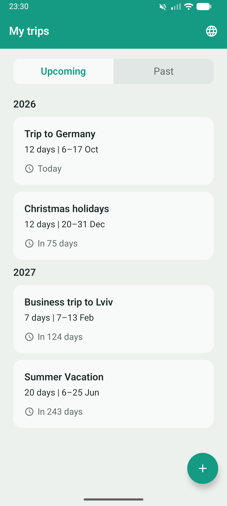
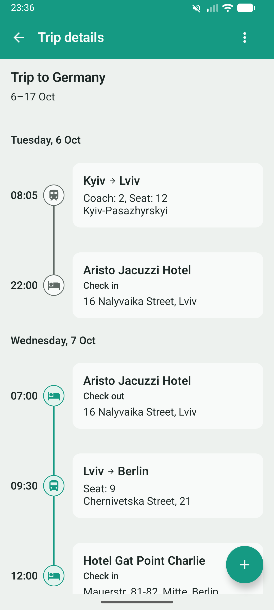
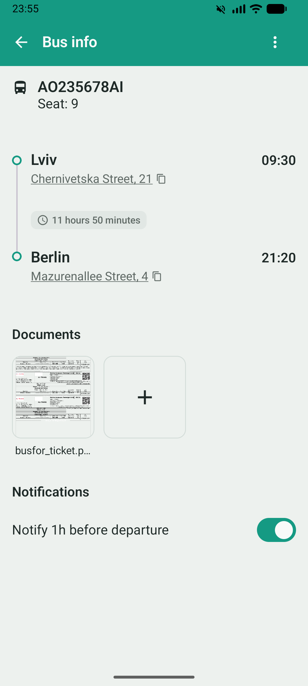

# Trip Pocket

A travel organizer for keeping trips, transport tickets, and travel details in one place.

  
  &nbsp;&nbsp;&nbsp;
  
  &nbsp;&nbsp;&nbsp;
  

## Features

- Create and manage trips
- Add transport/accomodation for the trip
- Receive notification before departure/checkin/checkout

## Tech Stack

- Kotlin
- Jetpack Compose
- Material 3
- Room
- SQLite
- Hilt

# Production version

## Release Build
1. Build → Generate Signed Bundle / APK.
2. Android App Bundle → Next.
3. Select the existing .jks keystore and enter its passwords and alias.
4. Choose release → Create.

## Privacy policy
https://sites.google.com/view/trip-pocket-privacy-policy